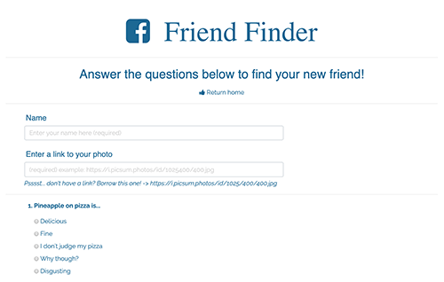

# Friend Finder

A party of one is no party at all!

Be matched up with like minded friends after answering a few simple questions!

## Click on the button to take the survey

## Fill out the survey 

## Click on the button to find your match

## Voila - you have been matched up with your new friend!

## Built With

* [HTML](https://developer.mozilla.org/en-US/docs/Web/HTML)
* [CSS](https://developer.mozilla.org/en-US/docs/Web/CSS)
* [Javascript](https://developer.mozilla.org/en-US/docs/Web/JavaScript)
* [jQuery](https://developer.mozilla.org/en-US/docs/Glossary/jQuery)
* [Node.js / Express](https://developer.mozilla.org/en-US/docs/Learn/Server-side/Express_Nodejs)

## Deployed Link

* [See Live Site](https://damp-mountain-00831.herokuapp.com/)

## Author

* **Jennifer Kruk** 

- [Link to Portfolio Site](https://jenkruk.github.io/Bootstrap-Portfolio/)
- [Link to Github](https://github.com/jenkruk)
- [Link to LinkedIn](https://www.linkedin.com/in/jennifer-k-97808519b/)

## License

This project is licensed under the MIT License 

